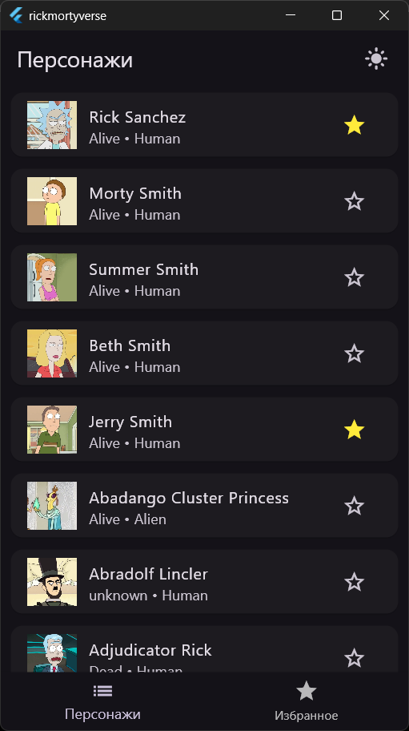
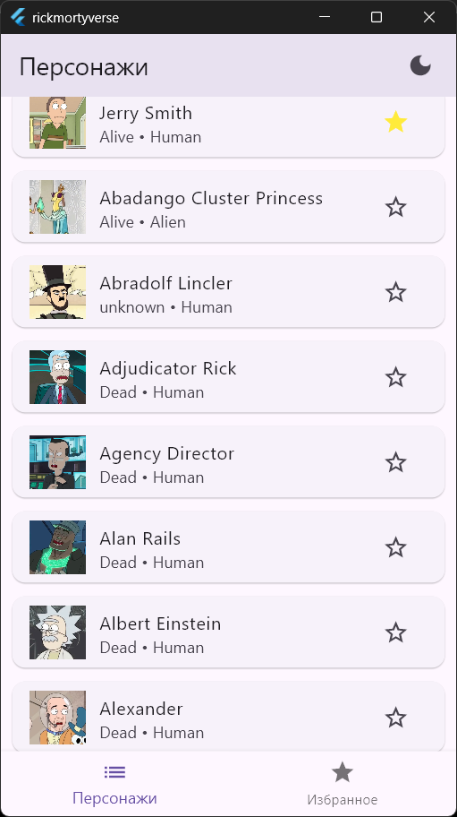
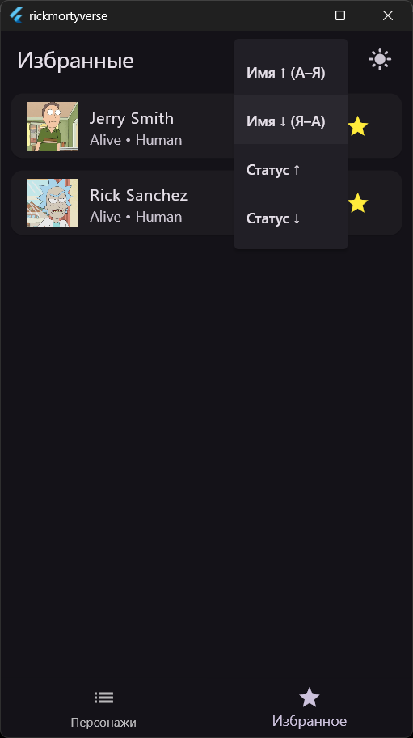
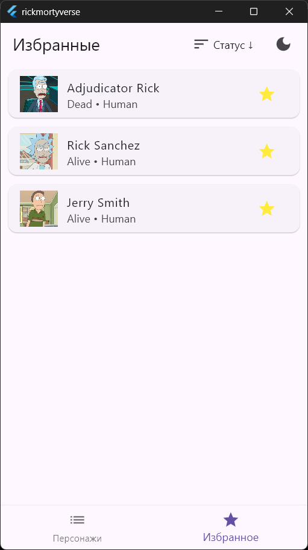

# rickmortyverse

Приложение на Flutter для просмотра, поиска и добавления в избранное персонажей культового мультсериала "Рик и Морти".

## Функционал и стек
* Пагинация: подгрузка новых персонажей на главном экране при скролле.
* Кеширование: загруженные данные сохраняются локально.
* Для кеширования используется Hive и cached_network_image.
* State management: Bloc.
* API-запросы через REST.
* Код должен быть чистым, читаемым и структурированным.
* Поддержка темной темы с возможностью переключения.
* Кастомные анимации при нажатии на звездоку добавления и удаления избранного.

## Скриншоты

| Light                                | Dark                                 |
| ------------------------------------ | ------------------------------------ |
|  |  |
|  |  |
